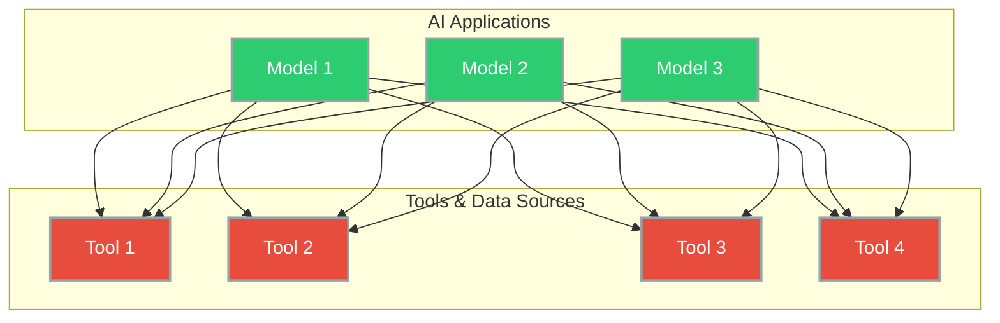
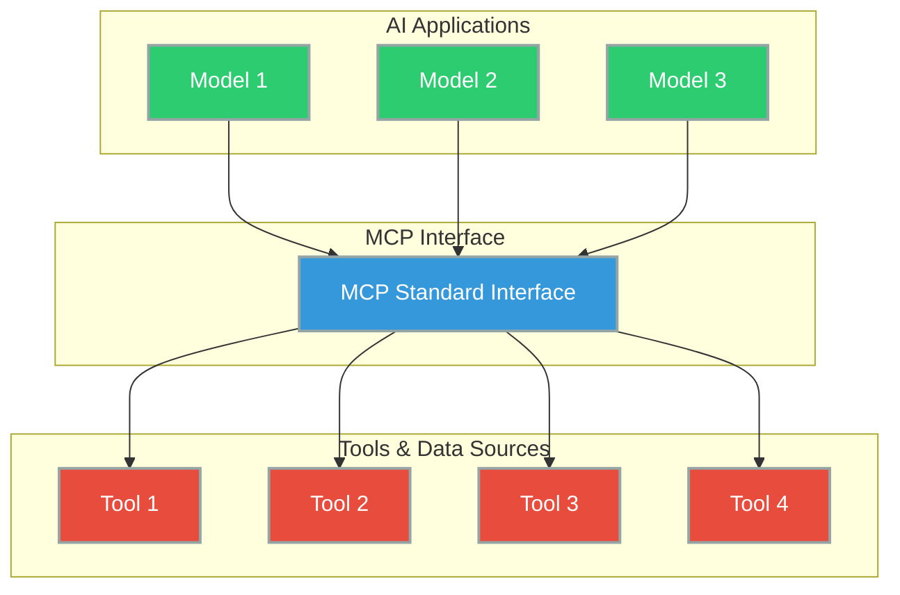

# Concepts and Terminology

## The Integration Problem

The **M×N** Integration Problem refers to the challenge of connecting M different AI applications to N different external tools or data sources without a standardized approach.

Today each AI application needs to integrate with each tool/data source individually. This is usually very complex and expensive process leading to friction for developers and high maintenace costs.

Once we have multiple models and multiple tools, the number of integrations becomes too large to manage, each with its own unique interface.
(MxN)



MCP transforms this into an M+N problem by providing a standard interface.
This dramatically reduces integration complexity and maintenance burden.



## Components

If you have been building software applications over the web, like me, then you're quite familar with the client server relationship in HTTP.
Similarly, MCP has a Client and a Server.

The MCP architecture consists of three main components:

1. **Host**: is the user-facing AI application. Users interact with this directly.</br>
    Examples: 
    - Anthropic’s Claude Desktop, 
    - AI-enhanced IDEs like Cursor, 
    - Custom AI agents 
2. **Client**: is a component within the Host application that manages communication with a specific MCP Server
3. **Server**: is an external program or service that exposes capabilities to AI models.


A key advantage of this architecture is its modularity. A single Host can connect to multiple Servers simultaneously via different Clients. New Servers can be added to the ecosystem without requiring changes to existing Hosts. Capabilities can be easily composed across different Servers.

</br>

> If you're confused between the Host and the Client, just remember that the host is the user facing application and the client is a component inside the host that manages the communication with a specific MCP server.

</br>

|Concepts|Description|Example|
|---------|-----------|-------|
|Resources|Expose data and content that can be read by clients and used as context for LLM interactions.|Accessing file contents, retrieving database records, reading configuration information.|
|Prompts  |Define reusable prompt templates and workflows that clients can easily surface to users and LLMs.|Common workflows, specialized task templates, guided interactions.|
|Tools    |Enable servers to expose executable functionality to clients, allowing LLMs to perform actions.|Sending messages, creating tickets, querying APIs, performing calculations.|
|Sampling | Allows servers to request LLM completions through the client, while maintaining security and privacy.|Complex multi-step tasks, autonomous agent workflows, interactive processes.|
|Roots    | Define the boundaries where servers can operate. They provide a way for clients to inform servers about relevant resources and their locations.|       |
|Transports|Foundation for communication between clients and servers. A transport handles the underlying mechanics of how messages are sent and received.|       |

</br>

## Communication Protocol [Optional]

MCP uses JSON-RPC 2.0 as the message format for all communication between clients and servers.
It's a lightweight remote procedure call protocol encoded in JSON.

In layman's terms,
- It's human readable
- Language agnostic
- Well established spec

The protocol defines three types of messages:

1. Requests

    Client => Server

    ```json
        {
            "jsonrpc": "2.0",
            "id": 1, // A unique identifier
            "method": "tools/call", // The method name to invoke
            "params": { // Parameters for the method (if any)
                "name": "weather",
                "arguments": {
                "location": "Amsterdam"
                }
            }
        }
    ```

2. Responses

    Client <= Server

    ```json
        {
            "jsonrpc": "2.0",
            "id": 1, // A unique identifier
            "result": { // result (on success) or 
                "temperature": 25,
                "conditions": "Sunny"
            }
        }
    ```

    ```json
        {
            "jsonrpc": "2.0",
            "id": 1,
            "error": { // error (on failure)
                "code": -10781,
                "message": "Invalid location"
            }
        }
    ```

3. Notifications

    One-way messages that don’t require a response.

    Client <= Server

    ```json
        {
            "jsonrpc": "2.0",
            "method": "progress",
            "params": {
                "message": "Processing data....",
                "percent": 75
            }
        }
    ```

## Transport Mechanisms

MCP specifies two primary transport mechanisms:

1. **stdio (Standard Input/Output)**: is used for local communication, where the Client and Server run on the same machine.

2. **HTTP + SSE (Server-Sent Events) / Streamable HTTP**: is used for remote communication, where the Client and Server might be on different machines.

    > In the most recent update, MCP now supports **Streamable HTTP**

## Lifecycle

The MCP protocol defines a structured interaction between Clients and Servers:

```mermaid
sequenceDiagram
    participant Client
    participant Server

    %% Initialization Phase
    rect rgb(60, 60, 80)
        Note over Client,Server: Initialization
        Client->>Server: Connect
        Server-->>Client: Protocol Version & Capabilities
        Client->>Server: Initialization Complete
    end

    %% Discovery Phase
    rect rgb(60, 80, 60)
        Note over Client,Server: Discovery
        Client->>Server: Request Available Capabilities
        Server-->>Client: List of Tools/Resources/Prompts
        loop For Each Capability
            Client->>Server: Request Details
            Server-->>Client: Capability Details
        end
    end

    %% Execution Phase
    rect rgb(80, 60, 60)
        Note over Client,Server: Execution
        loop As Needed
            Client->>Server: Invoke Capability
            Server-->>Client: Response
        end
    end

    %% Termination Phase
    rect rgb(80, 60, 80)
        Note over Client,Server: Termination
        Client->>Server: Shutdown Request
        Server-->>Client: Acknowledge Shutdown
        Client->>Server: Final Exit
    end
```



</br>
</br>


> MCP's initialization phase includes version negotiation, enabling backward compatibility and future extensibility. This design allows the protocol to evolve while maintaining compatibility with existing implementations.

</br>

## MCP Component Interaction Matrix

</br>

| Components | Controlled By | Direction | Approval Needed | Use Cases |
|------------|---------------|-----------|-----------------|-------------------|
| Tools | Model (LLM) | Client → Server | Yes | Actions, API calls, data manipulation |
| Resources | Application | Client → Server | Typically no | Data retrieval, context gathering |
| Prompts | User | Server → Client | No (selected by user) | Guided workflows, specialized templates |
| Sampling | Server | Server → Client → Server | Yes | Multi-step tasks, agentic behaviors |

</br>

## Dynamic Discovery

When a Client connects to a Server, it discovers:
- Available Tools `tools/list`
- Available Resources `resources/list`
- Available Prompts `prompts/list`

## Next Steps

Now that we understand the core concepts, components, and communication patterns of MCP, we're ready to put this knowledge into practice. In the next chapter, we'll set up our first MCP server using the Python SDK and learn how to implement these concepts in a real application.

</br>

[Next Chapter ➡](../3-server-setup/README.md)